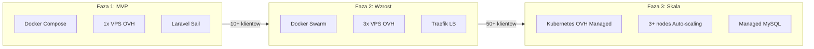
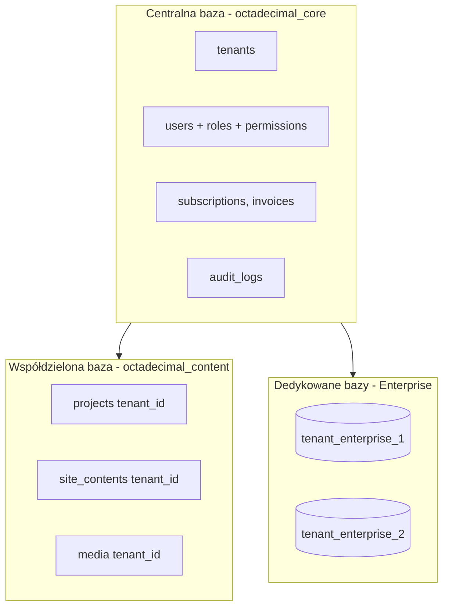
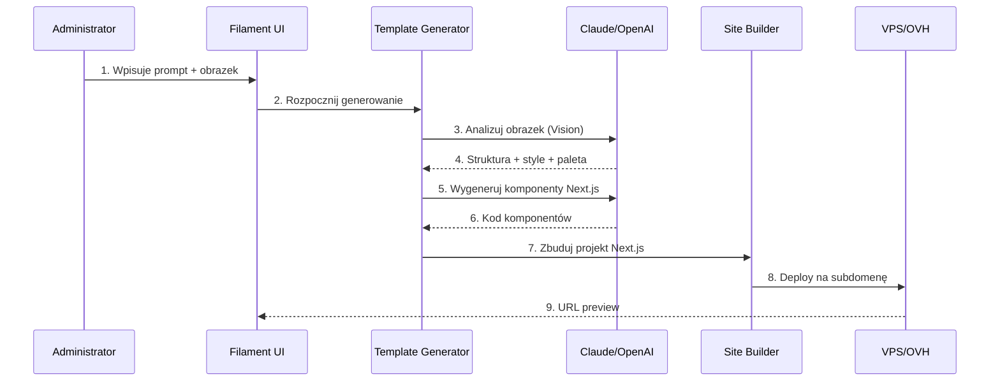
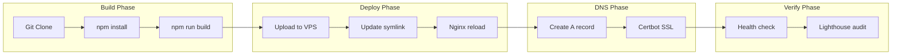

# Architektura Octadecimal Studio - Full Laravel Stack

## Wizja i kluczowe różnice względem v1

Główna zmiana: **eliminacja Strapi** na rzecz pełnego rozwiązania Laravel + Filament. Dzięki temu:

- Jeden stack technologiczny (PHP/Laravel) zamiast dwóch (PHP + Node.js)
- Lepsza kontrola nad kodem źródłowym
- Łatwiejsza automatyzacja i integracja
- Niższe koszty hostingu (jeden serwer)
- Prostsza architektura (brak synchronizacji między systemami)

---

## Stack technologiczny

### Backend (Full Open Source)

| Komponent | Technologia | Zastępuje z v1 |
|-----------|-------------|----------------|
| **Framework** | Laravel 11 | Laravel 11 (bez zmian) |
| **Admin Panel** | Filament 3 | Filament + Strapi Admin |
| **CMS/Content** | Filament Curator + własne moduły | Strapi CMS |
| **Autentykacja** | Laravel Breeze + Sanctum | Strapi Auth |
| **Obrazy** | Intervention Image 3 / Glide | Strapi Media Library |
| **API** | Laravel GraphQL (Lighthouse) + REST | Strapi GraphQL |
| **Queue** | Laravel Horizon | bez zmian |
| **Cache** | Redis | bez zmian |

### Frontend

| Komponent | Technologia |
|-----------|-------------|
| **Framework** | Next.js 16 (App Router) |
| **Data Fetching** | TanStack Query + GraphQL |
| **Styling** | Tailwind CSS + shadcn/ui |
| **Animacje** | Framer Motion |

### Integracje zewnętrzne

| Serwis | Cel | API |
|--------|-----|-----|
| **OVH** | DNS, subdomeny | OVH API |
| **VPS** | Deploy przez SSH | ssh2 |
| **Allegro** | Wystawianie projektów | Allegro REST API |
| **Claude/OpenAI** | Generowanie szablonów | API |
| **Cloudinary** | CDN obrazów (opcjonalnie) | Cloudinary SDK |

---

## Strategia infrastruktury - Podejście hybrydowe

System wykorzystuje **progresywną strategię konteneryzacji**, która rośnie wraz z projektem:



### Faza 1: Docker Compose (MVP)

**Cel:** Szybki start, niski koszt, pełna reprodukowalność środowiska.

**Struktura katalogów:**

```
docker/
├── docker-compose.yml          # Produkcja
├── docker-compose.dev.yml      # Development (override)
├── docker-compose.ci.yml       # CI/CD testing
├── .env.example
├── nginx/
│   └── default.conf
├── php/
│   ├── Dockerfile
│   └── php.ini
└── mysql/
    └── my.cnf
```

**Serwisy:**

- **app** - Laravel Application (php-fpm)
- **nginx** - Web Server
- **mysql** - Database (MySQL 8.0)
- **redis** - Cache
- **horizon** - Laravel Queue Worker
- **scheduler** - Laravel Cron
- **meilisearch** - Search (opcjonalnie)

### Faza 2: Docker Swarm (Wzrost)

**Cel:** Wysoka dostępność, load balancing, łatwiejsze skalowanie.

**Architektura klastra:**

- **Manager (VPS 1):** Traefik, MySQL, Redis
- **Worker 1 (VPS 2):** App x2, Horizon
- **Worker 2 (VPS 3):** App x2, Horizon

### Faza 3: Kubernetes (Skala)

**Cel:** Pełny auto-scaling, enterprise-grade HA, GitOps.

**OVH Managed Kubernetes:**

- Nodes: 3x b2-15 (4 vCPU, 15GB RAM)
- Region: GRA (Gravelines, Francja)
- Koszt: ~150 EUR/miesięcznie

---

## Multi-Tenancy i izolacja danych

### Strategia: Podejście hybrydowe

- **Mali/średni klienci (Starter, Pro):** Shared database z kolumną `tenant_id`
- **Enterprise/VIP klienci:** Dedykowana baza danych per tenant
- **Dane centralne (billing, audit):** Wspólna baza `octadecimal_core`



### Model danych - Tenancy

```
[tenants]
├── id, uuid, name, slug
├── domain: string (nullable)
├── plan: enum [starter, pro, enterprise]
├── database_type: enum [shared, dedicated]
├── database_name: string (nullable)
├── settings: JSON
├── created_at, updated_at

[users]
├── id, uuid, email, password
├── tenant_id: FK -> tenants (nullable dla super_admin)
├── is_super_admin: boolean
├── created_at, updated_at
```

### Warstwy zabezpieczeń (Defense in Depth)

| Warstwa | Mechanizm | Opis |
|---------|-----------|------|
| 1 | Middleware | Walidacja tenant z URL/session |
| 2 | Global Scopes | Automatyczna filtracja wszystkich zapytań |
| 3 | Policies | Autoryzacja per-resource |
| 4 | Mass Assignment Guard | Blokada zmiany tenant_id |
| 5 | Audit Logging | Logowanie wszystkich operacji |
| 6 | Security Tests | Automatyczne testy izolacji |

---

## System ról i uprawnień (RBAC)

### Hierarchia użytkowników

```
Super Admin (Octadecimal - pełny dostęp)
└── Tenant Admin (Właściciel klienta)
    ├── Tenant Manager (zarządzanie użytkownikami)
    │   ├── Project Owner (pełny dostęp do projektu)
    │   │   ├── Project Editor (edycja treści)
    │   │   └── Project Viewer (tylko odczyt)
    │   └── Content Editor (edycja treści wszystkich projektów)
    └── Viewer (tylko odczyt)
```

---

## AI Template Generator (kluczowa innowacja)

### Workflow generowania szablonu z promptu



---

## Deploy Manager

### Pipeline wdrożenia



---

## E2E Testing - 100% Platform Coverage

### Device/Browser Matrix

**Desktop OS:** Windows 10/11, macOS 13-15, Ubuntu 22/24, Fedora 40

**Mobile OS:** iOS 15-18, Android 11-15, ChromeOS

**Browsers:** Chrome, Firefox, Safari, Edge, Samsung Internet, Opera

**Viewports:** 320px, 375px, 414px, 768px, 1024px, 1280px, 1440px, 1920px, 2560px

**Total: ~200+ unique configurations**

### Test Execution Levels

| Level | Czas | Coverage | Trigger |
|-------|------|----------|---------|
| QUICK | 5 min | Chrome, 3 viewports | Każdy commit |
| STANDARD | 15 min | 3 browsers, 5 viewports | Każdy PR |
| FULL | 60 min | Wszystkie kombinacje | Merge to main |
| NIGHTLY | 4h | Full + edge cases | Cron 3:00 |

---

## Security Hardening

### OWASP Top 10 Protection

| Threat | Mitigation |
|--------|------------|
| Injection | Eloquent ORM, prepared statements, input validation |
| Broken Auth | Sanctum, rate limiting, MFA option |
| Sensitive Data | Encryption at rest (AES-256), TLS 1.3 |
| Broken Access | RBAC, policies, global scopes |
| XSS | Blade escaping, CSP headers |

---

## Struktura plików projektu

```
octadecimal.studio/
├── src/                          # Laravel Platform
│   ├── app/
│   │   └── Modules/
│   │       ├── Content/          # CMS - zastępuje Strapi
│   │       ├── Generator/        # AI Templates
│   │       ├── Deploy/           # VPS/OVH deployment
│   │       ├── Marketplace/      # Allegro integration
│   │       ├── Studio/           # Portfolio, projekty
│   │       └── Core/             # Shared - tenants, users
│   ├── graphql/
│   └── ...
├── templates/                    # Szablony Next.js
├── tools/                        # Narzędzia automatyzacji
│   ├── site-builder/
│   └── template-analyzer/
├── docs/                         # Dokumentacja
│   └── fazy/
└── docker/                       # Konfiguracja Docker
```

---

## Pełna dokumentacja

- [FAZA-1-MVP.md](fazy/FAZA-1-MVP.md) - Plan implementacji MVP
- [FAZA-2-GROWTH.md](fazy/FAZA-2-GROWTH.md) - Plan skalowania
- [FAZA-3-ENTERPRISE.md](fazy/FAZA-3-ENTERPRISE.md) - Funkcje enterprise
- [FAZA-4-PLATFORM.md](fazy/FAZA-4-PLATFORM.md) - Pełna platforma SaaS
